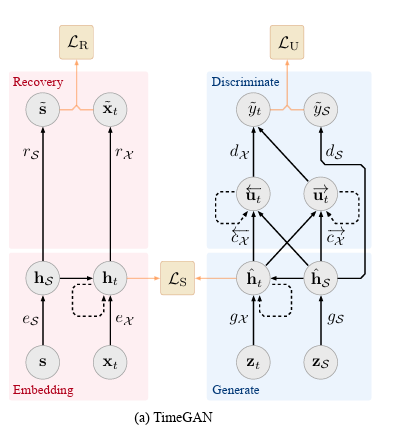
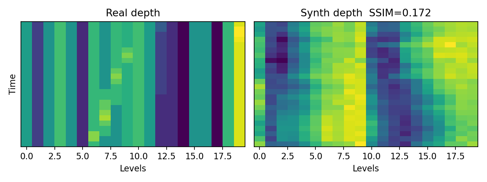
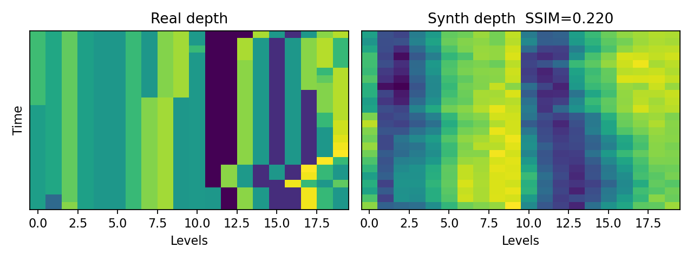
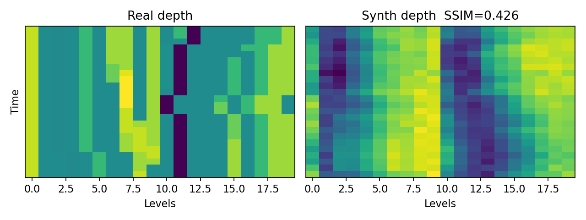
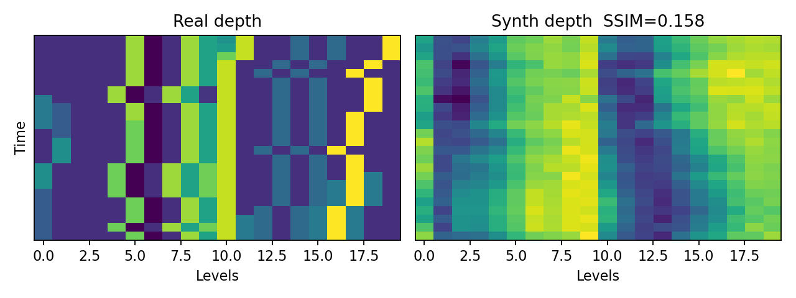
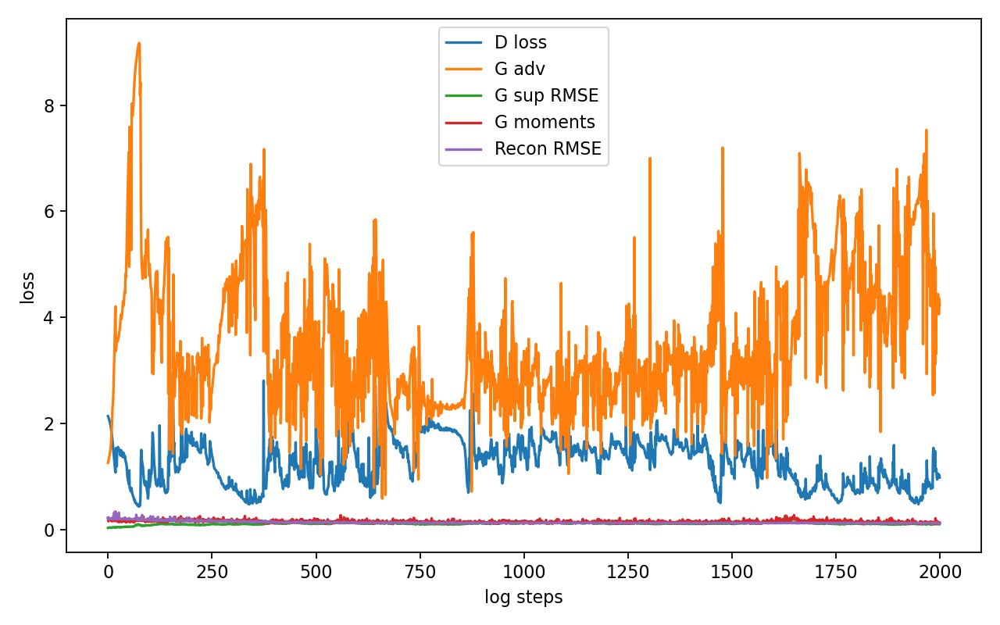

# ***Generative time-series model for Limit Order Book (LOB) events with TimeGAN***

Author: Miles Bojorge, 47438514

## Task
In this task, I will be generating synthetic sequences of Limit Order Book events using the LOBSTER dataset, more specifically AMZN level 10 data. TimeGAN was the selected model architecture for this project, since it bridges GANs to the time-series domain where preserving temporal dynamics is paramount.

# TimeGAN Architecture
TimeGAN is a framework for generating realistic time-series data across various domains. The model consists of four network components: an embedding function, recovery function, generator and discriminator. There is an additional network known as the supervisor that enforces step-wise latent transition dynamics. The autoencoding components are trained jointly with the adversarial components. The result is that TimeGAN is capable of simultaneously encoding features, generating representations and iterating over time. In this project's implementation, we have added an additional network known as a patch discriminator, with the idea that this should help pressure textures on a depth heatmap to more closely resemble real LOB depth level heatmaps.

As for the motivation behind TimeGAN, vanilla GANs learn independent and identically distributed snapshots, but they struggle with dependencies over time. This is exactly what makes TimeGAN relevant to the specific domain of this project. TimeGAN blends sequence modelling via RNNs with adversarial learning to preserve autocorrelations, periodicity and regime shifts. 

## Architectural components
* Embedder: maps obseverved sequences to a latent space. Essentially, the embedder is a representation learner that compresses high-dim data while keeping temporal structure.
* Recovery: decodes from latent space back to the original feature space, which forces the latent representation to be information preserving, and not just arbitrary.
* Generator: maps noise to synthetic latent paths. This is what actually generates the sequences, but it lives in the latent space learned by the embedder.
* Supervisor: predicts the next latent step. This is what injects an explicit temporal continuity prior, so generated sequences are not jittery or just static.
* Discriminator: distinguishes real latent trajectories from generated ones.
* Specific to our LOB setup *
* Patch discriminator: enforces local "texture" in the feature space, becomes relevant when heatmaps are generated. 



## Limit Order Book events
This project tackles the problem of generating realistic synthetic limit order book (LOB) sequences for research and model development when access to raw market data is limited or restricted. The goal is to produce time-series windows that faithfully capture price microstructure—including non-Gaussian, heavy-tailed mid-price returns, discrete tick-based spreads, and cross-level depth dynamics—while preserving temporal dependencies (autocorrelation, regime shifts) and cross-feature structure. By training a TimeGAN on engineered LOB features and validating with distributional metrics (KL divergence for mid-return and spread) and texture metrics (SSIM on depth heatmaps), we aim to create synthetic LOBs suitable for backtesting, stress testing, privacy-preserving data sharing, and downstream model training/augmentation, without leaking sensitive or proprietary order flow.

## The reference implementation
This project aimed to re-implement the [original TensorFlow implementation](https://github.com/jsyoon0823/TimeGAN/tree/master) associated with the [paper](https://papers.nips.cc/paper_files/paper/2019/hash/c9efe5f26cd17ba6216bbe2a7d26d490-Abstract.html), but in PyTorch and with additional data-preprocessing considerations for the LOB event domain. The implementation found at the linked repo was outdated, given it was implemented in 2019, with TensorFlow 1.X. Consequently, the repo had a very "monolithic" structure with all of the architectural and training concerns placed into `timegan.py`. Furthermore, all features were min-max scaled indiscriminantly, which is problematic if features are for example one-hot encoded. This was fine for the three example datasets provided, but wouldn't be for the LOBSTER dataset. In accordance with the spec and also for better coding practice, the project was constructed with the following file structure:
```
* predict.py
* train.py
* modules.py
* dataset.py
```

# Training

## Preprocessing

### Inputs
We used paired LOBSTER csvs for a single day of trading of the AMZN stock, with level 10 data.The two csvs were:
* Messages: Time, Type, Order ID, Size, Price, Direction
* Orderbook: AskPrice1, Asksize1, BidPrice1, Bidsize1, etc. up to depth D

We load both files, verify row alignment (as specified in the data's README), and construct fixed-width windows for TimeGAN. These files were combined since orderbook data alone doesn't allow TimeGAN to learn what orders are actually driving the orderbook.

### Engineered features
* Event type one-hot over classes {1,2,3,4,5,6,7}, 7 represents a trading halt but this was kept for completeness.
* Side (0,1) was derived from direction (-1, +1)
* Midprice delta (ticks): first difference of mid (ask1 + bid1)/2 divided by the tick size, which is clipped to a default band of +- 50 ticks.
* Spread (ticks): ask1 - bid1 divided by the tick size
* Inter-arrival time: derived from the message timestamps
* Depth sizes (for heatmaps and SSIM calculation), with log1p applied.
Tick size is configured to 100 LOBSTER price units. 

### Scaling
A min-max scaler is applied to continuous features only. This includes `mid_delta_ticks`, `log_size`, `log_dt` and depth sizes. The rest of the features are not scaled, including `spread_ticks` which was intentionally kept integer-like. The scaler is fit only on train rows and then used to transform val/test.

### Windowing
From the full time series T rows, sliding windows of length `seq_len` with stride `step` were created, yielding tensors of shape `[seq_len, num_features]`. Also worth noting:
* Train/val/test row splits were done as a typical 70/15/15 split, done by row index
* Windows are produced without materialising all windows in RAM. The dataset computes the start and end slices on the fly.
* DataLoaders are constructed for each split. The scaler is fit on train only.

### Depth heatmap helper
For visualisation and SSIM, `extract_depth_matrix(window, feat_idx, K)` was exposed to build a a matrix using `[BidSize1..K, AskSize1..K] from any window. This ensures real vs synthetic heatmaps are constructed with the same column ordering.

## Configuration
The below JSON output includes parameter count, GPU type, VRAM, epochs (referred to as iterations here), and total training time, as required. This JSON output is produced anytime `train.py` is run to completion.
```json
{
  "config": {
    "x_dim": 31,
    "z_dim": 31,
    "h_dim": 24,
    "rnn_layers": 3,
    "dropout": 0.0,
    "lr": 0.001,
    "batch_size": 128,
    "seq_len": 24,
    "step": 150,
    "depth": 10,
    "depth_levels": 10
  },
  "environment": {
    "torch_version": "2.7.1+cu118",
    "python": "3.13.7",
    "platform": "Windows-10-10.0.19045-SP0",
    "cuda_available": true,
    "cudnn_enabled": true,
    "device_type": "cuda",
    "gpu_index": 0,
    "gpu_name": "NVIDIA GeForce RTX 4070 SUPER",
    "cuda_runtime": "11.8",
    "capability": "8.9",
    "peak_allocated_bytes": 119172608,
    "peak_reserved_bytes": 163577856
  },
  "params": {
    "embedder": {
      "trainable": 15072,
      "total": 15072
    },
    "recovery": {
      "trainable": 15175,
      "total": 15175
    },
    "generator": {
      "trainable": 15072,
      "total": 15072
    },
    "supervisor": {
      "trainable": 14400,
      "total": 14400
    },
    "discriminator": {
      "trainable": 4825,
      "total": 4825
    },
    "patch_discriminator": {
      "trainable": 22401,
      "total": 22401
    },
    "total_trainable": 86945,
    "total": 86945
  },
  "strategy": {
    "pretrain_embed_iters": 1000,
    "pretrain_supervised_iters": 1000,
    "joint_iters": 2000,
    "loss_weights": {
      "gamma": 1.0,
      "sup_w": 25.0,
      "mom_w": 30.0
    },
    "variant_notes": "Full TimeGAN: reconstruction + supervised + adversarial (with moment matching)."
  },
  "phase_times_sec": {
    "pretrain_embed": 33.77164030075073,
    "pretrain_supervised": 23.719775915145874,
    "joint": 688.9165897369385
  },
  "total_time_sec": 746.4080431461334,
  "num_batches": {
    "pretrain_embed": 9000,
    "pretrain_supervised": 9000,
    "joint_GS": 36000,
    "joint_D": 18000
  },
  "batches_per_iter": 9
}
```

## Training strategy
TimeGAN is trained in three phases. First, an autoencoding warm-up trains the Embedder/Recovery to reconstruct inputs end-to-end, minimising reconstruction MSE over the training windows. Second, a supervised phase teaches the Supervisor to predict the next latent step, while the embedder is frozen. This enforces smooth temporal dynamics in the latent space. Finally, joint training alternates two Generator/Supervisor updates per Disciminator update. The generator produces the sequence, competes against the discriminator in the latent space, and is additionally regularised with supervised next-step loss and simple two-moment matching on features to pull synthetic means/variances towards real ones. Discriminator updates are gated to avoid overpowering the Generator, and this is implemented by only having the discriminator step when its loss exceeds a small threshold. In my implementation, I also added a Patch discriminator that looks directly at short time x feature "textures" in the original feature space to encourage depth-map locality, and its adversarial signal is blended into the generator objective during joint training. This was necessary since before this addition, even after lengthy joint training, the synthetic heat map of depth was overly "smooth", and not as blocky/rectangular as the heatmap generated by real LOB sequences.

# Results

## Outputs
The following outputs were produced with `predict.py`. 
```json
{
  "KL_mid_return": 1.0776222116117733,
  "KL_spread": 5.772012531488025,
  "SSIM_depth": [
    0.17244912961512684,
    0.2201572597698523,
    0.42605468613051234,
    0.1579488474748186
  ],
  "notes": "KL on inverse-scaled engineered features; heatmaps use log1p depth sizes normalized to [0,1]."
}
```






## Error analysis
Clearly, the desired results were not obtained both in terms of SSIM between real vs synthetic depth heatmaps, and KL divergence for midprice and spread. Due to time constraints and the length of time required to train the model, this was not rectified.

### Where the synthetic LOBs succeeded
* Less "wavy Gaussian" drift in depth maps. Introducing a feature-space Patch discriminator (local Conv2D over time x feature) reduced overly smooth, blob-like textures. The synthetic heatpmaps became blockier than earlier baselines, which better resembled true LOB event textures.
* Focused feature moments: adding explicity moment matching on mid-return and spread prevented extreme scale mismatch and stabilised early training phases

### Where the synthetic LOBs failed
* Discrete spread PMF: Even with discrete KL evaluation, spread PMF is poorly matched (KL=5.77). This could reflect under-weighting small ticks or perhaps spurious mass in unlikely ticks.
* Mid-return tails and volatility. KL for mid-return remains far from the target of 0.1, indicating poor matching of heavy-tailed, Non-Gaussian behaviour.
* Mean SSIM of 0.24 shows the model still lacks per-level persistence. The Patch discriminator helped here a bit, but it wasn't sufficient to enforce realistic lag-1 autocorrelation
* There was also observed late-phase collapse/drift. During joint training, I observed KL initially improving but then worsening with additional iterations, which became particularly bad if joint training was allowed to train for a full 50000 iterations like in the reference implementation. This could be a sign of adversarial imbalance, or perhaps the generator overfitting to the discriminator's current weaknesses and drifting off the desired statistics.

### What was attempted
* I tried the standard hyperparamter sweeps but none of these resolved the core failures. The changes mainly shifted speed of convergence or caused short-lived improvements that later regressed during joint training. For example:
  * Supervisor weight: 10, 25, 50 100. Higher supervisor weight improved short-term smoothness in latent space but didn't translate to better mid-return tails or spread PMF.
  * Discriminator gate: thresholds 0.2-0.5. Looser gate resulted in faster adversarial progress plus earlier drift. Tighter gate slowed but didn't prevent regression.
  etc.
Ultimately, the lack of success of hyperparameter tuning points more towards objective or inductive bias gaps.

* Feature-moment emphasis for mid and spread. I added a focused moment penalty on mid_delta_ticks and spread_ticks. This stabilised scales/variance but didn't fix discreteness or tails, meaning the KL targets did not improve substantially.
* After research, two additional terms were added to the objective function to attempt "temporal persistence shaping". Temporal total-variation on depth sizes were introduced to favour piecewise-constant level trajectories. Lag-1 autocorrelation matching per level was also added to teach short-term stickiness. These together gave the synthetic heatmap a "blockier" appearance that was desired, but fell short of producing strong vertical bands which would have helped reach the target SSIM of 0.6.

### Limitations and scope
Given the time constraints and the complexity of the problem, I stopped once it became clear that further progress would require structural changes, not just more hyperparam sweeps. 

# Usage
This is an example usage with all of the args given values. However, only messages and orderbook are necessary arg, the rest are optional. If excluded, the default values will be used. Simply provide the relative filepath to whereever these files are stored locally. The CSVs can be installed from [here](https://lobsterdata.com/info/DataSamples.php), ensure to install level 10 data.
```bash
# Train 
python train.py \
  --messages AMZN_2012-06-21_34200000_57600000_message_10.csv \
  --orderbook AMZN_2012-06-21_34200000_57600000_orderbook_10.csv \
  --depth 10 --seq_len 24 --step 150 \
  --batch_size 128 --hidden 24 --layers 3 \
  --depth_levels 10 --iters_pre_embed 1000--iters_pre_sup 1000 \
  --iters_joint 2000 --sup_w 25 --mom_w 30 \
  --out synth.pt

# Evaluate
python predict.py \
  --messages AMZN_2012-06-21_34200000_57600000_message_10.csv \
  --orderbook AMZN_2012-06-21_34200000_57600000_orderbook_10.csv \
  --depth 10 --seq_len 24 --step 150 \
  --depth_levels 10 --synth synth.pt --n_heatmaps 4 \
  --out_dir eval_figs

# Or, simply run
python train.py --messages AMZN_2012-06-21_34200000_57600000_message_10.csv --orderbook AMZN_2012-06-21_34200000_57600000_orderbook_10.csv

python predict.py --messages AMZN_2012-06-21_34200000_57600000_message_10.csv --orderbook AMZN_2012-06-21_34200000_57600000_orderbook_10.csv
```

## Dependencies
To install the required dependencies with the correct versions, run the following
```bash
pip install -r requirements.txt
```

# References
Jinsung Yoon, Daniel Jarrett, Mihaela van der Schaar, "Time-series Generative Adversarial Networks," Neural Information Processing Systems (NeurIPS), 2019. https://papers.nips.cc/paper/8789-time-series-generative-adversarial-networks

Yoon, J. (2019), "Codebase for "Time-series Generative Adversarial Networks (TimeGAN)"". GitHub repository. https://github.com/jsyoon0823/TimeGAN

Alhalabi, H. (2024), "What is a Limit Order Book?" https://b2broker.com/library/what-is-a-limit-order-book/

"LOBSTER: high-frequency, easy-to-use and latest limit order book data for your research." https://lobsterdata.com/

_Some code suggestions (e.g., function stubs, docstrings, and syntax completions) were assisted by Codex in Visual Studio Code. All design descisions around data preprocessing, model configuration, and analysis were written by the author._